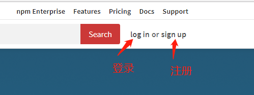

# npm 发布流程 npm 包发布 node_modules 发布

## 简介
本项目主要描述了`npm`包发布流程，仅作为小白学习`npm`发布学习使用。

## 流程

- 在GitHub上创建一个项目（例如：test-projects）
- 克隆（git clone)到本地
- npm初始化（npm init）
- 注册npm账号及登录npm（如果您没有npm账号的话）
- 命令行登录npm账号
- npm包发布（npm publish --access=public)
- npm包版本更新
- 删除包(如果你想作死的话)

### 创建 GitHub 项目

创建项目属于`Git`操作，这里不再描述，如果您对创建`GitHub`项目创建与管理不熟悉的话，可以参考下列文章：
- [《GitHub项目管理基本操作》](https://blog.csdn.net/weixin_41424247/article/details/78998916)
- [《git-bash管理Github/Gitee项目常用命令》](https://blog.csdn.net/weixin_41424247/article/details/79007443)
- [《常用git命令 （使用频率最高的15个）》](https://blog.csdn.net/weixin_41424247/article/details/86626610)

例如：
```bash
https://github.com/loushengyue/test-projects
```

### npm 初始化

在上述步骤克隆下来的项目目录（test-projects）下，执行一些命令：

```bash
npm init
```
按照提示完成类似以下内容的输入：

```bash
package name: (test-projects)
version: (1.0.0)
description: this is my test-project for npm publish
entry point: (index.js)
test command: hello world.
git repository: (https://github.com/loushengyue/test-projects.git)
keywords: test test-pro test-projects
author: loushengyue
license: (ISC)

```
说明：
|配置项|功能|
|---|---|
|package name|项目名称（要求在npm官网具有唯一性，不允许有大写字母，通常由字母，中横线，@符号组成）|
|version|版本号（要求每次npm publish前修改，必须大于之前的版本）|
|description|项目描述信息（这个可以随便写点关于项目的介绍信息）|
|entry point|入口文件，通常用index.js|
|test command|测试命令，执行npm run test命令时的输出信息或命令|
|git repository|项目的GitHub地址，会在npm官网添加该项目的GitHub链接|
|keywords|关键词（在npm官网搜索专用关键词，能够增加搜索效率）|
|author|作者（请写上您的大名，让别人认识你）|
|license|版权，权限（默认ISO就行）|


### 注册npm账号及登录npm

用浏览器打开`npm`官网[https://www.npmjs.com/](https://www.npmjs.com/)，点击[sign up](https://www.npmjs.com/signup)注册，点击[log in](https://www.npmjs.com/login)登录。

图示：


**注意：** 想要发布`npm`包需要上述注册信息，务必牢记注册名称，密码及邮箱（例如账号：loushengyue，密码：xxxxxx，邮箱：loushengyue@foxmail.com）。

### 命令行登录npm账号
这里的登录跟上述网页版的登录不是一个概念，这是的登录是用来发布的，上述网页版的登录是用来查看已发布的npm包信息及个人账号信息的。

在命令行工具中执行`npm login`命令：
```bash
$ npm login
Username: loushengyue
Password: xxxxxx
Email: (this IS public) loushengyue@foxmail.com
Logged in as loushengyue on https://registry.npmjs.org/.
```
**注意：** 账号，密码及邮箱必须跟注册时的信息保持一致，否则无法登录。


### npm包发布

首次发布命令：
```
npm publish --access=public
```
**注意：** 上述项目名称有可能不可用，不可用的原因通常是npm官网上已发布了相同、类似名称的项目。例如上述的`test-projects`项目名称就会报错：
```bash
npm ERR! publish Failed PUT 403
npm ERR! code E403
npm ERR! Package name too similar to existing packages; try renaming your package to '@loushengyue/test-projects' and publishing with 'npm publish --access=public' instead : test-projects
```
假如你遇到了上述问题，可以修改`package.json`的`name`值（保证它具有唯一性），例如：
```json
"name": "test-pro-xxxx",
```
然后再次执行`npm publish --access=public`命令，当显示类似下列信息则表示发布成功：
```bash
$ npm publish --access=public
npm notice
npm notice package: test-pro-xxxx@1.0.0
npm notice === Tarball Contents ===
npm notice 556B   package.json
npm notice 28.6kB aa.png
npm notice 3.3kB  README.md
npm notice === Tarball Details ===
npm notice name:          test-pro-xxxx
npm notice version:       1.0.0
npm notice package size:  29.9 kB
npm notice unpacked size: 32.4 kB
npm notice shasum:        b53645b9ce51e9e7b1e6b9d7a9e346c6176c848d
npm notice integrity:     sha512-RUOZ32q0TGIn6[...]+cyY2NCTUGviw==
npm notice total files:   3
npm notice
+ test-pro-xxxx@1.0.0
```

### npm包版本更新

**注意：** 务必修改`package.json`文件中的`version`信息，通常只能递增，可以手动修改，也可以通过命令行来修改。

例如这里我发布`test-pro-xxxx`的1.0.1版本。
```json
  "name": "test-pro-xxxx",
  "version": "1.0.1",
```
然后执行`npm publish`命令：
```bash
$ npm publish
npm notice
npm notice package: test-pro-xxxx@1.0.1
npm notice === Tarball Contents ===
npm notice 556B   package.json
npm notice 28.6kB aa.png
npm notice 5.1kB  README.md
npm notice === Tarball Details ===
npm notice name:          test-pro-xxxx
npm notice version:       1.0.1
npm notice package size:  30.7 kB
npm notice unpacked size: 34.2 kB
npm notice shasum:        aa3736f22702dcdf621c7573f661eef5534fe56c
npm notice integrity:     sha512-p5OT3ONm+BgIJ[...]it7/CMjELwqNg==
npm notice total files:   3
npm notice
+ test-pro-xxxx@1.0.1
```

### 删除包
npm包发布，通常不建议删除（假如有某某用户已经使用了你的npm包，这时候删除npm包是很没道理的）。

```bash
npm unpublish 依赖包名称 --force
```